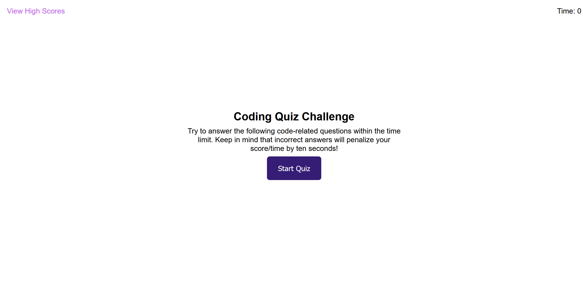

# code-quiz
A timed, short multiple choice quiz with Javascript related questions.

## Description
A timed (75 Seconds), short multiple choice quiz with Javascript related questions, an incorrect answer will deduct ten seconds from the timer, your final score is the time for completion. This score can then be saved with your initials and viewed on the high scores page sorted in descending order against any other saved scores. Scores can also be completely reset. Tab accessibility was something I considered on this one, an important concept in good accessibility practices. 

## Installation

NA

## Usage

The end result can be viewed [here.](https://jaredboehm.github.io/code-quiz/)

## License

NA